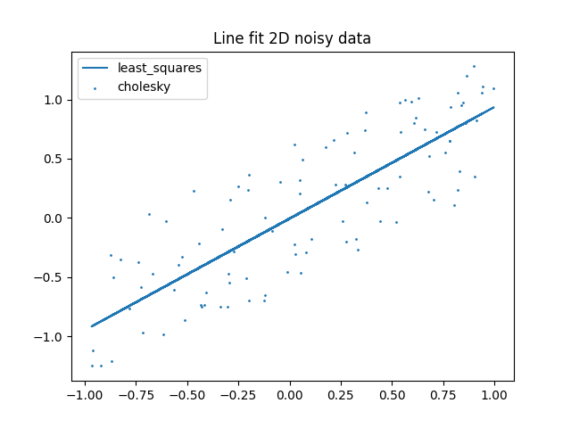

# Fit a line to 2D noisy data

## Requirements

```bash
sudo apt-get install -y cmake libeigen3-dev libqt5charts5-dev python-numpy qt5-default
pip3 install matplotlib numpy
```

## Build

```bash
mkdir build
cmake ..
make -j4
```

## Try

```bash
./fit_noisy_data_2d [ARGS]
```



### Arguments

* `--noise`: { `linear`, `quadratic`, `cholesky` }
* `--solver`: { `least_squares` }

## Testing

A simple unit test was made to debug the `linear_fitting` library.

```bash
sudo apt-get install libgtest-dev
./linear_fitting/linear_fitting_test
```

## Third party libraries

Two third party libraries were used in the project:

* [`matplotlib_cpp`](https://github.com/Cryoris/matplotlib-cpp): For plotting the data with Eigen. License MIT.
* [Lightweight Parsing Command Line Arguments](https://www.codeproject.com/Tips/5261900/Cplusplus-Lightweight-Parsing-Command-Line-Argumen): License CPOL.
